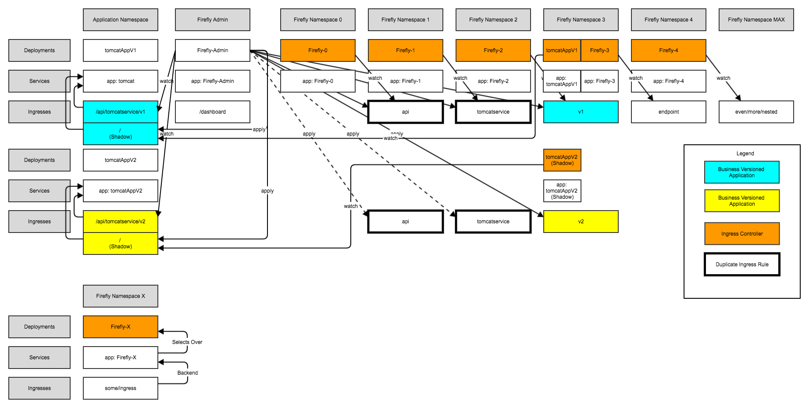
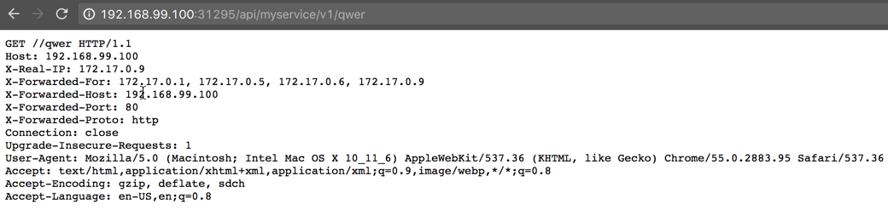

# Firefly

> Ingress. Ingress Everywhere.

## Disclaimer

This is a Proof of Concept and a learning experience. It was also built (hastily) in a day. Feel free to modify/use code for your own use!

## Motivation

Firefly was created to provide a more concrete example of both:
* using the [client-go](https://godoc.org/k8s.io/client-go) library
* using watchers to do something neat

The idea is to have a team define ONE ingress resource but use multiple Ingress Controllers to coalesce Ingress across a cluster. Also, this would remove load (number of signals sent) from the "Edge" Ingress Controllers to the cluster at large.

## What Works

* The basic example that is detailed in the picture (only the first row)

## What Doesn't Work

* Multiple paths in an Ingress
* Multiple application Namespaces
* No dashboard for viewing the global routing state

## Architecture



Unfortunately, you can have an Ingress definition point to a service located in another Namespace. To solve this, I have added a "shadow" Serivce, Deployment, and Ingress Definition to push traffic in the other direction.


## How to use

```
go get github.com/jgensler8/firefly
# Edit main.go and change default values
go build
kubectl create -f examples/sampleapplication.yaml
./firefly
```

Then, navigate to both the shadow service's NodePort (in Namespace `firefly3`) and the Firefly0 Service's NodePort with the path "/api/myservice/v1/asdf"


